# gitchat

A skill and a set of scripts that let an agent in one Git
checkout send a prompt to an agent in another, using
branches on a remote they share as the transport. Each
message is a small JSON envelope committed to the sender's
`gitchat/<sender>-outbox` branch and pushed.

A poll stops returning a prompt once it is answered.

<picture>
  <source
    media="(prefers-reduced-motion: reduce)"
    srcset="assets/poster.svg"
  />
  
</picture>

The demo is reconstructed from
[`evidence/transcripts/send-poll-session.txt`](evidence/transcripts/send-poll-session.txt),
a captured run of `gitchat_send.py` and `gitchat_poll.py`
in two throwaway repositories that share a local bare
remote. The demo leaves out the JSON line each send prints
and every line of the polled envelope except `kind` and
`msg`.

**Read this before you serve.** A gitchat server runs what
it is sent.

- Push access to the remote equals prompt execution with
  full agent permissions on the serving host. Anyone who can
  push a `gitchat/*-outbox` branch can address a prompt to a
  server, and the server hands the body of a prompt its
  guards accept to its worker command.
- The default workers disable approvals and sandboxing and
  fetch packages at run time. `gitchat_pick_worker.py` runs
  `npx -y @openai/codex --yolo exec` or
  `npx @anthropic-ai/claude-code -p --dangerously-skip-permissions`.
- The orchestration guard is pattern matching, not a
  security boundary.
- Use only a private remote with trusted writers.

[`SECURITY.md`](SECURITY.md) has the detail and the known
limits.

**Not measured, stated up front.**

- No agent used the skill to produce the evidence here. The
  transcript shows `gitchat_send.py` and `gitchat_poll.py`
  run from a shell, on one machine, against a local bare
  repository.
- No Codex or Claude Code worker was run for this release.
  The serve loop, the log bridge and channel binding are
  exercised only by the test suite, where a worker is a stub
  or a `sleep` or `echo` command. `gitchat_pick_worker.py`,
  `gitchat_tail.py` and the systemd unit have no tests here.
- No run against a network remote, across two hosts, or
  with `GITHUB_TOKEN` set was recorded.
- Whether an agent that follows `SKILL.md` keeps to its
  cycle and fanout rules has not been measured.
- The scripts are carried over from a private deployment
  with their behaviour unchanged. Where a document and a
  script disagree, the script is what runs; the
  disagreements found so far are under "Known limits" in
  `SECURITY.md`.
- Neither Claude Code nor Codex was started to confirm that
  the invocation names below resolve.

## What is in it

- [`skills/gitchat/SKILL.md`](skills/gitchat/SKILL.md) is
  the protocol an agent follows: the invocation forms, the
  envelope schema, display, streaming, and the cycle and
  fanout rules.
- [`skills/gitchat/references/transport-scripts.md`](skills/gitchat/references/transport-scripts.md),
  [`skills/gitchat/references/tiered-dispatch.md`](skills/gitchat/references/tiered-dispatch.md),
  [`skills/gitchat/references/log-streaming.md`](skills/gitchat/references/log-streaming.md)
  and
  [`skills/gitchat/references/running-indefinitely.md`](skills/gitchat/references/running-indefinitely.md)
  are four sections of the protocol kept out of `SKILL.md`
  for length. `SKILL.md` repeats the four security statements
  above, so they travel with an installed copy.
- Under [`skills/gitchat/scripts/`](skills/gitchat/scripts):
  - `gitchat_send.py` publishes one envelope. It skips a
    terminal reply when its sender's outbox already holds a
    matching one; `SECURITY.md` says what matches.
  - `gitchat_poll.py` prints the oldest pending prompt for a
    slug, or all of them with `--all`.
  - `gitchat_tail.py` prints one conversation as it arrives
    and writes nothing to the remote. It does not validate
    what it prints; `SKILL.md` lists its limits.
  - `gitchat_serve.py` is a listener loop that passes each
    prompt its guards accept to a worker command and
    publishes the worker's output as the reply. Started
    without a channel manifest, it cannot answer a prompt
    that carries operation identity; see `SECURITY.md`.
  - `gitchat_pick_worker.py` is a worker that chooses
    between the Codex and Claude Code command lines.
  - `gitchat_serve_forever.sh` restarts `gitchat_serve.py`
    when it exits with a non-zero status.
  - `gitchat_stream_log.py` publishes the tail of a growing
    log file as progress messages.
  - `gitchat_channel.py` checks a committed channel manifest
    against the remote's URL. The send, poll, tail, serve and
    log scripts load it.
- [`skills/gitchat/systemd/gitchat-serve@.service`](skills/gitchat/systemd/gitchat-serve@.service)
  is a systemd user unit that runs `gitchat_serve_forever.sh`.

The scripts need `python3` and `git`. Publishing the first
message on a new outbox branch uses
`git worktree add --orphan`, which needs git 2.42 or later.
The tests were run on Python 3.9, 3.11 and 3.13 on macOS;
nothing here was run on Windows.

By default the scripts keep envelopes under
`.agents/gitchat/messages/` on the outbox branches and
local state under `.agents/gitchat/state/` in the working
tree. `--message-dir` and `--state-dir` change both; the
recorded session uses `messages/` and `state/`.

## Not included

- **A wrapper.** `SKILL.md` expects a consuming repository
  to bind its own host slugs, remote and paths in a thin
  wrapper. None ships here.
- **A usage command.** `gitchat_pick_worker.py` and
  `gitchat_serve_forever.sh` default to
  `make -s usage ARGS=--json` to read remaining capacity.
  No such make target ships. When that command fails,
  prints nothing, prints something that is not JSON, prints
  a JSON object without a `panels` list, or leaves no
  provider with a panel, a numeric `percent` and a value
  under the threshold, the worker falls back to
  `--default-provider` and says so on standard error.
  Usage JSON of another unexpected shape is not validated
  and can make the worker exit with a traceback. That
  includes `NaN` and `Infinity`, which Python's decoder
  accepts: printed alone they raise, and a `NaN` percent is
  not rejected, so a provider over the threshold can then be
  chosen.
- **The agent command lines.** The default worker templates
  fetch `@openai/codex` and `@anthropic-ai/claude-code`
  through `npx` when they run, and name model ids that your
  account may not have. Pass `--codex-cmd` and
  `--claude-cmd`, or set `GITCHAT_CHEAP_CMD` and
  `GITCHAT_MAX_CMD`, to use your own.
- **A channel manifest.** `--channel-manifest` reads a
  tracked JSON file that you write: an object with a
  non-empty `schema` string and a `channel` object holding
  `id` (which must be `github.com/` followed by
  `repository`, compared without case), `repository`
  (`owner/name`), `remote`, `message_dir`, and optionally
  `strict_after` (`YYYYMMDDTHHMMSSZ`). No example file
  ships, and the check accepts only `github.com` remotes.
- **`ticks` and `inbox`.** `SKILL.md` lists
  `gitchat(server:<slug>, ticks:<N>)` and
  `gitchat(inbox:<slug>)` as forms for the agent to carry
  out. No script implements them; `gitchat_serve.py` has
  only `--once`.
- **`tmux`.** `gitchat_stream_log.py --watch-session` needs
  it.
- **A second transport.** The private origin also carried a
  separate event-log transport with its own reference
  documents and tests. It is not part of this release, and
  none of the scripts here import it.

## Use it

Read [`skills/gitchat/SKILL.md`](skills/gitchat/SKILL.md)
and [`SECURITY.md`](SECURITY.md) before you install it. The
file is an instruction set that steers an agent, so both
installs below are pinned to a tag rather than to `main`.

### Claude Code

Save this as `install.sh` and run it with `sh install.sh`.
It sets `set -eu` and an `EXIT` trap, so pasting it straight
into an interactive shell will end that shell if the clone
fails.

```sh
set -eu
release=v0.1.0
install_target="$HOME/.claude/skills/gitchat"
install_parent="$(dirname "$install_target")"
mkdir -p "$install_parent"
install_tmp="$(mktemp -d "$install_parent/.gitchat.XXXXXX")"
install_stage="$install_tmp/package"
rollback_install() {
  if [ ! -e "$install_target" ]; then
    if [ -e "$install_tmp/previous" ]; then
      mv "$install_tmp/previous" "$install_target"
    fi
  fi
  rm -rf "$install_tmp"
}
trap rollback_install EXIT
git clone --quiet --depth 1 --branch "$release" \
  https://github.com/trycopilotai/gitchat \
  "$install_tmp/clone"
mkdir -p "$install_stage"
cp -R "$install_tmp/clone/skill/." "$install_stage/"
if [ -e "$install_target" ]; then
  mv "$install_target" "$install_tmp/previous"
fi
mv "$install_stage" "$install_target"
trap - EXIT
rm -rf "$install_tmp"
```

Invoke it as `/gitchat`.

### Codex

Save this one the same way. The only line that differs from
the block above is `install_target`.

```sh
set -eu
release=v0.1.0
install_target="$HOME/.agents/skills/gitchat"
install_parent="$(dirname "$install_target")"
mkdir -p "$install_parent"
install_tmp="$(mktemp -d "$install_parent/.gitchat.XXXXXX")"
install_stage="$install_tmp/package"
rollback_install() {
  if [ ! -e "$install_target" ]; then
    if [ -e "$install_tmp/previous" ]; then
      mv "$install_tmp/previous" "$install_target"
    fi
  fi
  rm -rf "$install_tmp"
}
trap rollback_install EXIT
git clone --quiet --depth 1 --branch "$release" \
  https://github.com/trycopilotai/gitchat \
  "$install_tmp/clone"
mkdir -p "$install_stage"
cp -R "$install_tmp/clone/skill/." "$install_stage/"
if [ -e "$install_target" ]; then
  mv "$install_target" "$install_tmp/previous"
fi
mv "$install_stage" "$install_target"
trap - EXIT
rm -rf "$install_tmp"
```

Invoke it as `$gitchat`.

Each block works in a temporary `.gitchat.*` directory
beside the target and removes it on exit. An existing
install at the target is replaced.

In a rehearsal against a local clone, git 2.50.1 printed a
warning that the tag "is not a commit" and a detached-`HEAD`
note while cloning, despite `--quiet`. Both are harmless for
a clone pinned to an annotated tag. Another git version, or
a clone over HTTPS, may print neither.

Both blocks copy through `skill/`, a symlink to
`skills/gitchat/`, so the installed directory holds
`SKILL.md`, `agents/`, `references/`, `scripts/` and
`systemd/` as real files. The repository also carries
`.claude-plugin/plugin.json` and `.codex-plugin/plugin.json`
for a marketplace. No marketplace lists this skill, so no
marketplace install is described here.

## Evidence

`evidence/transcripts/send-poll-session.txt` is the captured
run behind the claim at the top of this file. In it, `alpha`
sends a prompt to `beta`; a poll as `beta` prints that
prompt; `beta` publishes a `response` whose `reply_to` is
the prompt's id; the same poll then prints nothing, and
`--all` prints `[]`.

"Answered" here is what `gitchat_poll.py` checks: after the
poll's fetch, the polling slug's outbox branch holds, under
the poll's message directory, a well-formed `response`,
`error` or `ack` envelope from that slug to the prompt's
sender whose `reply_to` is the prompt's id. Four things
narrow that. An envelope written by the log script does not
count. For a prompt without an operation id, a reply that
carries one does not count. For a prompt with one, the reply
must carry the same channel id, operation id and digest,
except that under a channel manifest with no `strict_after`
a reply in the same conversation that carries no operation
fields counts too. With a channel manifest the reply must
also pass the channel check. Envelopes are de-duplicated by
id across all outbox branches, so a reply that shares its id
with an envelope on another branch can go unseen. A poll
also stops returning a prompt that was recorded with
`--mark-seen`; the session does not use that.

`scripts/record_session.py` wrote each `$` line and each
exit status; the rest is the two programs' output, as
captured, with no edits. Before it writes the transcript,
the script looks in the capture for two exact strings, the
resolved path of its throwaway directory and the value of
`socket.gethostname()`, and writes nothing if it finds
either. It makes no other check; the packaging test
separately rejects `/var/folders`, `/tmp`, `/Users` and
`/home` in the transcript.
`evidence/demo-manifest.json` records the shell functions
and commands, the interpreter, the git version, the date
(local time, while the ids in the transcript are UTC),
and the SHA-256 of `SKILL.md`, of the three programs the
session ran, and of the transcript. The ids, timestamps and
nonces in the transcript are as recorded and differ on every
recording.

`make check` runs the transport tests and a packaging
contract that ties this file, both plugin manifests, the
transcript and the demo images to each other. It needs
`pytest`; the suite was run with `pytest==8.3.4`:

```sh
python3 -m venv .venv
.venv/bin/python -m pip install pytest==8.3.4
make check PYTHON=.venv/bin/python
```

## Contributing

See [`CONTRIBUTING.md`](CONTRIBUTING.md).

## Security

See [`SECURITY.md`](SECURITY.md).

## License

MIT. See [`LICENSE`](LICENSE).

## Not affiliated with GitHub or GitHub Copilot

The `trycopilotai` organisation name is not a claim of any
relationship with GitHub Copilot. This project is not
affiliated with, endorsed by, or sponsored by GitHub, Inc.
GitHub and GitHub Copilot are trademarks of GitHub, Inc.
